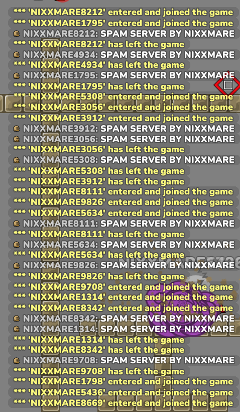
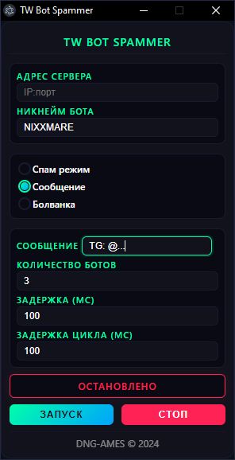

# TW Bot Spammer

<p align="center">
  
</p>

<p align="center">
  <em>Мощный спамер ботов для Teeworlds/DDNet от компании <a href="https://dngames.ru/">DNG-AMES</a></em>
</p>

## ✨ Возможности

- 🔄 **Режим Спама**: Быстрое подключение/отключение ботов (дикий флуд чата, но можно обойти)
- 🤖 **Режим Болванки**: Подключение ботов без действий (просто стоят на сервере)
- 💬 **Режим Сообщений**: Заспамь чат своими сообщениями (нельзя обойти, чистейший флуд)
- ⚙️ **Настраиваемые параметры**:
  - До 4 ботов (В DDNet поддержка до 4 айпи, если вы играете и смотрите за ботами, то уже 3 айпи = 3 бота)
  - Настраиваемая задержка подключения
  - Настраиваемый цикл работы
  - Поддержка пользовательских сообщений и никнеймов

## 📸 Скриншоты

<p align="center">
  
  
  
</p>

## 🚀 Установка

1. Если нет Node.js, скачайте его:
```bash
https://nodejs.org/en
```

2. Клонируйте репозиторий:
```bash
git clone https://github.com/fail4k/TW-Bot-Spammer.git
```

3. Перейдите в папку проекта:
```bash
cd TW-Bot-Spammer
```

4. Установите зависимости:
```bash
npm install
```

5. Запустите приложение:
```bash
npm start
```

Или просто скачайте готовую версию с релизов и запустите exe файл.

## 🎮 Использование

1. Введите IP и порт сервера (формат: `IP:порт`, например: 88.198.50.133:8537)
2. Выберите режим работы:
   - **Режим Спама**: Постоянное подключение/отключение ботов
   - **Режим Болванки**: Боты просто стоят на сервере
   - **Режим Сообщений**: Спам выбранным сообщением
3. Настройте параметры:
   - Количество ботов (1-4)
   - Задержка подключения
   - Задержка цикла
   - Никнейм бота
   - Сообщение для спама
4. Нажмите ЗАПУСК для старта
5. Нажмите СТОП для остановки всех ботов

## 🛠️ Сборка

Чтобы собрать приложение для вашей платформы:

```bash
npm run build
```

## 📝 Используемые библиотеки

Проект использует [teeworlds-library-ts](https://github.com/swarfeya/teeworlds-library-ts) - библиотеку для создания ботов Teeworlds.

## ⚠️ Отказ от ответственности

Этот инструмент создан исключительно в образовательных целях. Пользователи несут полную ответственность за соблюдение правил серверов.

## 🔮 Планы на будущее

- 🔒 **Поддержка прокси**
  - Добавление поддержки HTTP/SOCKS5 прокси
  - Возможность использования списка прокси

- 💿 **Использование ботов**
  - Добавление возможности частичного управления ботами

## 💰 Поддержать разработчика

Если вам нравится проект и вы хотите поддержать его развитие:
- 🎁 **DonationAlerts**: [donationalerts.com/r/nixxmare](https://www.donationalerts.com/r/nixxmare)

## 👥 Автор

Создано с 💚 командой [DNG-AMES](https://dngames.ru/) © 2024

---

<p align="center">
  Сделано с 🔥 для сообщества Teeworlds
</p>
