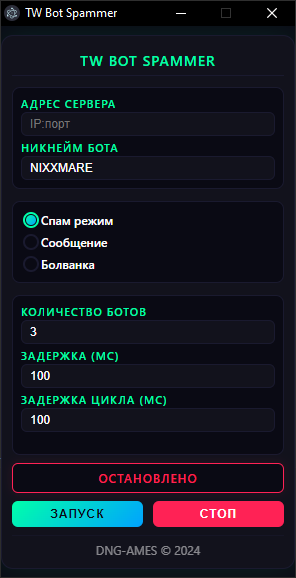
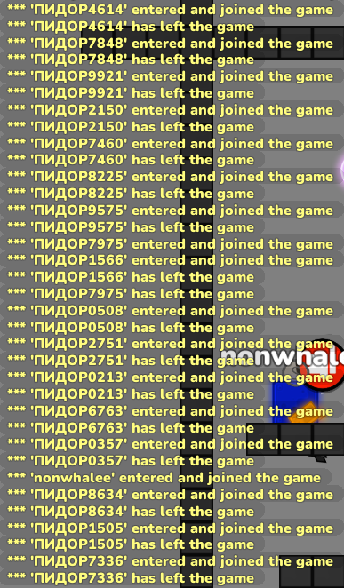
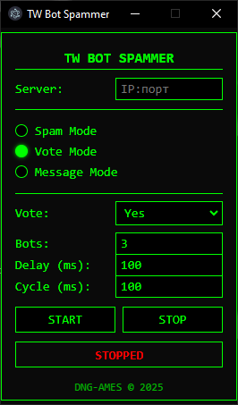
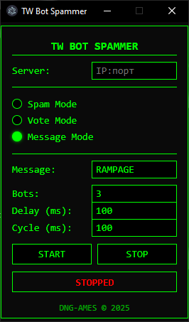

# TW Bot Spammer

<p align="center">
  
</p>

<p align="center">
  <em>Мощный спамер ботов для Teeworlds/DDNet от компании <a href="https://dngames.ru/">DNG-AMES</a></em>
</p>

## ✨ Возможности

- 🔄 **Режим Спама**: Быстрое подключение/отключение ботов(дикий флуд чата, но можно обойти)
- 🗳️ **Режим Голосования**: Голосование несколькими ботами(иногда может помочь чтобы кикнуть дебила)(плохо работает)
- 💬 **Режим Сообщений**: Заспамь чат своими сообщениями(нельзя обойти, чистейший флуд)
- ⚙️ **Настраиваемые параметры**:
  - До 4 ботов(В DDNet поддержка до 4 айпи, тоесть если вы играете и смотрите за ботами, то уже 3 айпи, тоесть 3 бота)
  - Настраиваемая задержка подключения
  - Настраиваемый цикл работы
  - Поддержка пользовательских сообщений

## 📸 Скриншоты

<p align="center">
  
  
  
</p>

## 🚀 Установка

1. Клонируйте репозиторий

```bash
git clone https://github.com/fail4k/TW-Bot-Spammer
```

2. Установите зависимости

```bash
npm install
```

3. Запустите приложение

```bash
npm start
```

4. Если нету Node.js то скачайте его
```
https://nodejs.org/en
```

## 🎮 Использование

1. Введите IP и порт сервера (формат: `IP:порт`, например: 88.198.50.133:8537)
2. Выберите режим работы:
   - **Режим Спама**: Постоянное подключение/отключение ботов
   - **Режим Голосования**: Голосование (Да/Нет)
   - **Режим Сообщений**: Спам выбранным сообщением
3. Настройте параметры:
   - Количество ботов (1-4)
   - Задержка подключения
   - Задержка цикла
4. Нажмите START для запуска
5. Нажмите STOP для остановки всех ботов

## 🛠️ Сборка

Чтобы собрать приложение для вашей платформы:

```bash
npm run build
```

## 📝 Используемые библиотеки

Проект использует [teeworlds-library-ts](https://github.com/swarfeya/teeworlds-library-ts) - библиотеку для создания ботов Teeworlds.

## ⚠️ Отказ от ответственности

Этот инструмент создан исключительно в образовательных целях. Пользователи несут ответственность за соблюдение правил серверов.

## 👥 Автор

Создано с 💚 командой [DNG-AMES](https://dngames.ru/) © 2024

---

<p align="center">
  Сделано с 🔥 для сообщества Teeworlds
</p>
