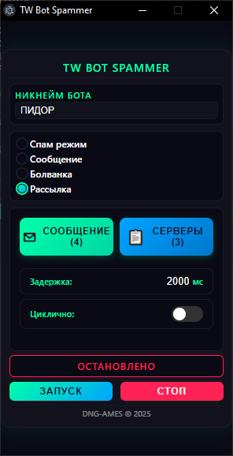
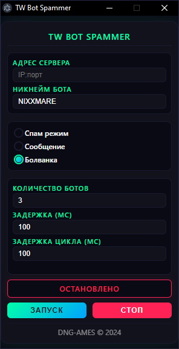

# TW Bot Spammer

<p align="center">
  
</p>

<p align="center">
  <em>Мощный спамер ботов для Teeworlds/DDNet от fail4k(ник в ddnet)</em>
</p>

## ✨ Возможности

- 🔄 **Режим Спама**: Быстрое подключение/отключение ботов для максимального флуда чата
- 🗳️ **Режим Болванки**: Подключение ботов с возможностью голосования (полностью стабильная работа)
- 💬 **Режим Сообщений**: Заспамь чат своими сообщениями с высокой эффективностью
- 📨 **Режим Рассылки**: Автоматическая рассылка сообщений по списку серверов с поддержкой циклов
- ⚙️ **Настраиваемые параметры**:
  - До 4 ботов одновременно с улучшенной стабильностью
  - Настраиваемые задержки подключения/отключения
  - Циклический режим работы с сохранением настроек
  - Расширенная поддержка всех серверов DDNet

## 📸 Скриншоты

<p align="center">
  
  
  
</p>

## 🚀 Установка

1. Клонируйте репозиторий

```bash
git clone https://github.com/fail4k/TW-Bot-Spammer
```

2. Установите зависимости

```bash
npm install
```

3. Запустите приложение

```bash
npm start
```

4. Если нету Node.js то скачайте его
```
https://nodejs.org/en
```

## 🎮 Использование

1. Введите IP и порт сервера (формат: `IP:порт`, например: 88.198.50.133:8537)
2. Выберите режим работы:
   - **Режим Спама**: Постоянное подключение/отключение ботов
   - **Режим Болванки**: Подключение и удержание ботов
   - **Режим Сообщений**: Спам выбранным сообщением
   - **Режим Рассылки**: Отправка сообщений по списку серверов
3. Настройте параметры:
   - Количество ботов (1-4)
   - Задержка подключения и цикла
   - В режиме рассылки - список серверов и циклический режим
4. Нажмите ЗАПУСК для запуска
5. Нажмите СТОП для остановки всех ботов

## 🛠️ Сборка

Чтобы собрать портативное приложение для Windows:

```bash
npm run dist
```

## 📝 Используемые технологии

- **Electron** - для создания кросс-платформенного приложения
- **DDNet Client v17** - для обхода большинства ограничений серверов
- **teeworlds-library-ts** - библиотека для ботов: https://github.com/swarfeya/teeworlds-library-ts

## ⚠️ Отказ от ответственности

Этот инструмент создан исключительно в образовательных целях. Пользователи несут ответственность за соблюдение правил серверов.

## 👥 Автор

Создано с 💚 командой [DNG-AMES](https://t.me/dng_Ames) © 2025

---

<p align="center">
  Сделано с 🔥 для сообщества Teeworlds
</p>
